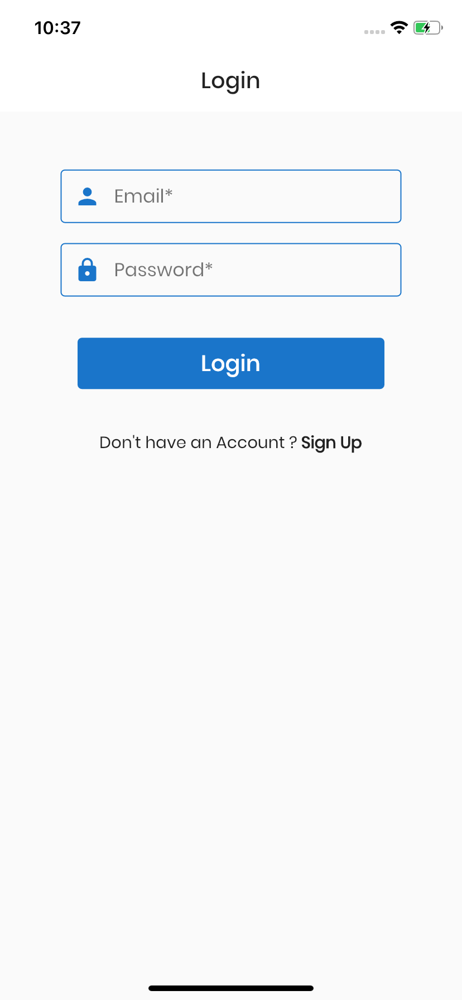
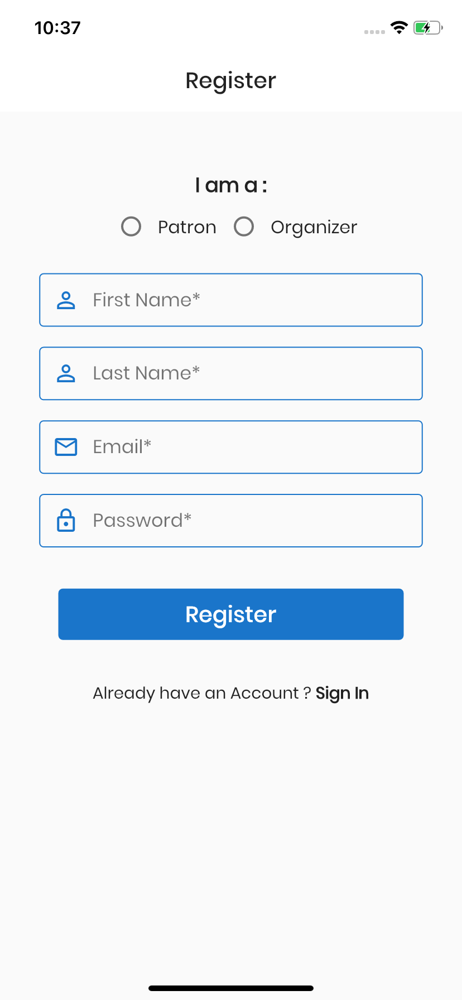

# Eband Mobile

Eband mobile application.

## Getting Started

### Step 1:

Download or clone this repo by using the following link:
[https://github.com/jasminetracey/eband-mobile](https://github.com/jasminetracey/eband-mobile)

### Step 2: Running the project with Firebase

To use this project with Firebase authentication, some configuration steps are required.

- Create a new project with the Firebase console.
- Add iOS and Android apps in the Firebase project settings.
- On Android, use `com.eband.app` as the package name.
- then, [download and copy](https://firebase.google.com/docs/flutter/setup#configure_an_android_app) `google-services.json` into `android/app`.
- On iOS, use `com.eband.app` as the bundle ID.
- then, [download and copy](https://firebase.google.com/docs/flutter/setup#configure_an_ios_app) `GoogleService-Info.plist` into `iOS/Runner`, and add it to the Runner target in Xcode.

See this document for full instructions:

- [https://firebase.google.com/docs/flutter/setup](https://firebase.google.com/docs/flutter/setup)

### Step 3:

Go to the project root and execute the following command to get all dependencies packages:
`flutter pub get`

### Step 4:

Done. Try launch the app using emulator or your preferred physical test device. For first time user, you need to create a new account from the app.

## Functionalities

- [ ] Internet Connection checks
- [ ] Image caching
- [ ] Theme

### Patron

- [x] Login, Registration and Sign Out
- [ ] Forget Password
- [ ] Email Confirmation
- [ ] User profile updating
- [ ] QR Code generation - save to database maybe
- [x] List of Upcoming Events
- [ ] Patron registered events
- [ ] Patron past events
- [ ] Event registration
- [x] Event Payment
- [ ] Event details - present
- [ ] Event details - past
- [x] Wristband Registration and Payment(not actually implemented)
- [x] Wristband details - qr code
- [x] Wristband details - details
- [ ] Wristband details - active events
- [x] Wristband Activation and De-Activation
- [x] Wristband Top Up

### Organizer

- [x] Login, Registration and Sign Out
- [ ] Forget Password
- [ ] Email Confirmation
- [ ] User profile updating
- [x] List of Organizer's events
- [ ] List of other organizer's upcoming events
- [x] Event creation
- [ ] Event updating
- [ ] Event deleting
- [ ] Event Management

### Merchant

- [ ] Login, Registration and Sign Out
- [ ] Forget Password
- [ ] Email Confirmation
- [ ] User profile updating
